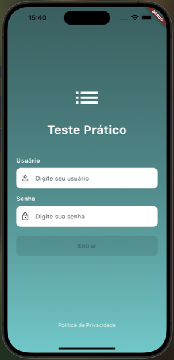
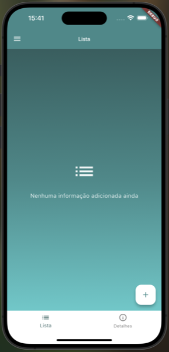
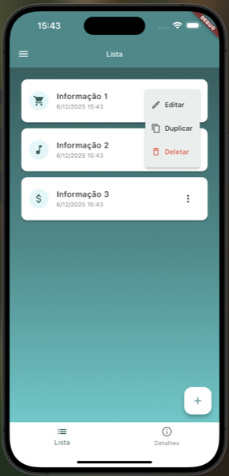
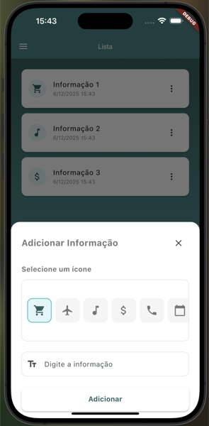
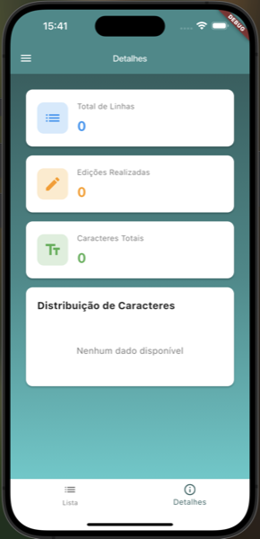
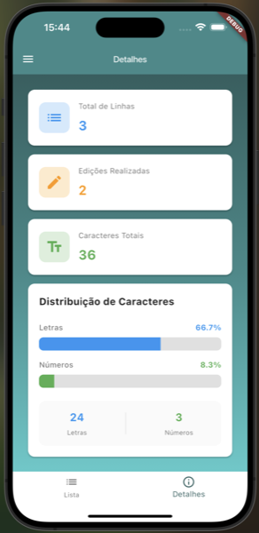
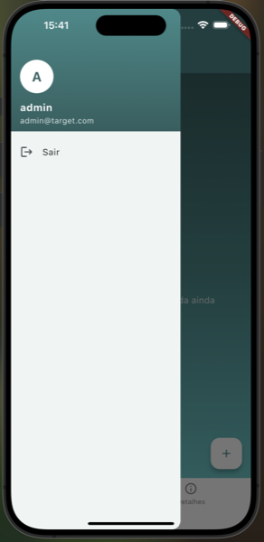

# 🎯 Target Test

Target é um aplicativo Flutter desenvolvido para Android e iOS, seguindo os princípios de Clean Architecture, com gerenciamento de estado reativo usando MobX e injeção de dependências com GetIt.

## 📋 Índice

- [Funcionalidades](#-funcionalidades)
- [Tecnologias](#-tecnologias)
- [Arquitetura](#-arquitetura)
- [Estrutura do Projeto](#-estrutura-do-projeto)
- [Pré-requisitos](#-pré-requisitos)
- [Instalação](#-instalação)
- [Como Executar](#-como-executar)
- [Estrutura de Módulos](#-estrutura-de-módulos)
- [Tema e Design](#-tema-e-design)
- [Capturas de Tela](#-capturas-de-tela)
- [Credenciais de Teste](#-credenciais-de-teste)
- [Geração de Código](#-geração-de-código)
- [Testes](#-testes)
- [Contribuição](#-contribuição)

## ✨ Funcionalidades

### Autenticação
- ✅ Tela de login com validação de campos
- ✅ Sistema de autenticação mock para demonstração
- ✅ Gerenciamento de sessão do usuário
- ✅ Proteção de rotas baseada em autenticação
- ✅ Logout via drawer navigation

### Gerenciamento de Informações
- ✅ Lista de informações com cards personalizados
- ✅ Adicionar novas informações com ícone selecionável
- ✅ Editar informações existentes
- ✅ Duplicar informações
- ✅ Excluir informações com confirmação
- ✅ Visualização de data e hora de criação

### Estatísticas e Análise
- ✅ Dashboard de estatísticas com:
  - Total de linhas adicionadas
  - Contagem de edições realizadas
  - Total de caracteres
  - Distribuição percentual de letras e números
  - Gráficos visuais de distribuição

### Navegação
- ✅ Navegação entre Lista e Detalhes via Bottom Navigation
- ✅ AppBar reutilizável com drawer navigation
- ✅ Rotas protegidas com redirecionamento automático
- ✅ Tela de Política de Privacidade

## 🛠 Tecnologias

### Core
- **Flutter** - Framework multiplataforma
- **Dart** - Linguagem de programação (SDK 3.7.2+)

### State Management
- **MobX** (v2.4.1) - Gerenciamento de estado reativo
- **flutter_mobx** (v2.2.0) - Bindings Flutter para MobX

### Navigation
- **go_router** (v14.6.2) - Roteamento declarativo e type-safe

### Dependency Injection
- **get_it** (v8.0.2) - Service locator para injeção de dependências

### Code Generation
- **build_runner** (v2.4.13) - Geração de código
- **mobx_codegen** (v2.6.1) - Geração de código MobX

### Linting
- **flutter_lints** (v5.0.0) - Conjunto de regras de lint recomendadas

## 🏗 Arquitetura

O projeto segue os princípios de **Clean Architecture**, dividido em camadas bem definidas:

### Camadas

1. **Domain** (Camada de Domínio)
   - Entidades puras
   - Interfaces de repositórios
   - Casos de uso (Use Cases)

2. **Data** (Camada de Dados)
   - Implementação de repositórios
   - Data sources (local/remote)
   - Modelos de dados

3. **Presentation** (Camada de Apresentação)
   - Páginas (Pages)
   - Stores (MobX)
   - Widgets específicos do módulo

### Princípios Aplicados

- **Separation of Concerns**: Cada camada tem responsabilidade única
- **Dependency Inversion**: Dependências apontam para abstrações (interfaces)
- **Single Responsibility**: Cada classe tem uma única responsabilidade
- **Modularidade**: Código organizado em módulos independentes

## 📁 Estrutura do Projeto

```
lib/
├── core/                          # Funcionalidades core da aplicação
│   ├── injection/                 # Configuração de injeção de dependências
│   │   └── injection_container.dart
│   ├── routes/                    # Configuração de rotas
│   │   └── app_router.dart
│   ├── services/                  # Serviços globais
│   │   └── session_service.dart
│   └── theme/                     # Tema centralizado
│       └── app_theme.dart
│
├── modules/                       # Módulos da aplicação
│   ├── auth/                      # Módulo de autenticação
│   │   ├── data/
│   │   │   ├── datasources/
│   │   │   ├── models/
│   │   │   └── repositories/
│   │   ├── domain/
│   │   │   ├── entities/
│   │   │   ├── repositories/
│   │   │   └── usecases/
│   │   └── presentation/
│   │       ├── pages/
│   │       └── stores/
│   │
│   └── listing/                   # Módulo de listagem
│       ├── domain/
│       │   └── entities/
│       └── presentation/
│           ├── pages/
│           ├── stores/
│           └── widgets/
│
├── shared/                        # Recursos compartilhados
│   ├── pages/                     # Páginas compartilhadas
│   ├── services/                  # Serviços compartilhados
│   │   └── toast_service.dart
│   └── widgets/                   # Widgets reutilizáveis
│       ├── custom_app_bar.dart
│       ├── custom_button.dart
│       ├── custom_text_field.dart
│       ├── gradient_background.dart
│       ├── privacy_policy_footer.dart
│       └── spacing.dart
│
└── main.dart                      # Ponto de entrada da aplicação
```

## 📋 Pré-requisitos

Antes de começar, certifique-se de ter instalado:

- [Flutter](https://flutter.dev/docs/get-started/install) (versão estável)
- [FVM](https://fvm.app/) (Flutter Version Management) - Opcional, mas recomendado
- [Dart](https://dart.dev/get-dart) (geralmente vem com Flutter)
- Um emulador Android ou iOS, ou um dispositivo físico

## 🚀 Instalação

1. **Clone o repositório**
```bash
git clone <url-do-repositório>
cd target
```

2. **Instale as dependências**
```bash
flutter pub get
```

Se estiver usando FVM:
```bash
fvm flutter pub get
```

3. **Gere os arquivos necessários**
```bash
flutter pub run build_runner build --delete-conflicting-outputs
```

Ou com FVM:
```bash
fvm flutter pub run build_runner build --delete-conflicting-outputs
```

## ▶️ Como Executar

### Android
```bash
flutter run
```

Ou com FVM:
```bash
fvm flutter run
```

### iOS
```bash
flutter run
```

**Nota**: Para iOS, você precisará de um Mac e ter o Xcode instalado.


## 📦 Estrutura de Módulos

### Módulo Auth (Autenticação)

#### Domain
- **entities/**: Entidade `User`
- **repositories/**: Interface `AuthRepository`
- **usecases/**: `LoginUsecase`

#### Data
- **datasources/**: `AuthDatasource` (mock implementado)
- **models/**: Modelo de dados `UserModel`
- **repositories/**: Implementação `AuthRepositoryImpl`

#### Presentation
- **pages/**: `LoginPage`
- **stores/**: `AuthStore` (MobX)

### Módulo Listing (Listagem)

#### Domain
- **entities/**: Entidade `Information`

#### Presentation
- **pages/**: `ListingPage`, `DetailsPage`
- **stores/**: `ListingStore` (MobX)
- **widgets/**: `InformationCard`, `InformationBottomSheet`

## 🎨 Tema e Design

O aplicativo utiliza um sistema de tema centralizado definido em `AppTheme`, garantindo consistência visual em toda a aplicação.

### Cores Principais
- **Primary**: Teal (`#3A8A8A`)
- **Primary Light**: (`#4ECACA`)
- **Primary Dark**: (`#2D5F5F`)

### Gradiente Padrão
O aplicativo utiliza um gradiente verde/azul em várias telas, definido em `AppTheme.gradientColors`.

### Componentes Reutilizáveis

- `CustomTextField`: Campo de texto padronizado
- `CustomButton`: Botão com suporte a loading
- `CustomAppBar`: AppBar com drawer navigation
- `GradientBackground`: Background com gradiente
- `InformationCard`: Card para exibir informações
- `InformationBottomSheet`: BottomSheet para adicionar/editar informações
- `Spacing`: Utilitários para espaçamento padronizado

## 📸 Capturas de Tela

### Tela de Login


### Lista de Informações

#### Lista Vazia


#### Lista com Informações


### Adicionando Informação


### Tela de Detalhes

#### Detalhes Vazio


#### Detalhes com Estatísticas


### Menu de Logout


### Vídeo Demonstrativo
Para ver o aplicativo em ação, confira o vídeo: [Video_utilizando.mov](Imagens_App/Video_utilizando.mov)

## 🔐 Credenciais de Teste

Para testar a autenticação, use as seguintes credenciais (mock):

- **Usuário**: `admin`
- **Senha**: `admin123`

## 🧪 Geração de Código

O projeto utiliza code generation para o MobX. Sempre que modificar um Store, execute:

```bash
flutter pub run build_runner build --delete-conflicting-outputs
```

Ou para watch mode (regenera automaticamente):

```bash
flutter pub run build_runner watch --delete-conflicting-outputs
```

## 🧪 Testes

O projeto inclui testes unitários para garantir a qualidade e confiabilidade do código. Os testes são escritos usando `flutter_test` e seguem o padrão Arrange-Act-Assert.

### Executando os Testes

Para executar todos os testes:

```bash
flutter test
```

Para executar um arquivo de teste específico:

```bash
flutter test test/modules/listing/presentation/stores/listing_store_add_information_test.dart
```

### Testes de Adição de Cards

O arquivo `listing_store_add_information_test.dart` contém testes unitários focados na funcionalidade de adição de cards (informações) no `ListingStore`.

#### Localização
```
test/modules/listing/presentation/stores/listing_store_add_information_test.dart
```

#### Cobertura de Testes

Os testes cobrem os seguintes cenários:

1. **Adição bem-sucedida**
   - ✅ Adiciona uma informação com sucesso
   - ✅ Verifica que a informação foi adicionada corretamente
   - ✅ Valida que `errorMessage` está nulo após sucesso
   - ✅ Verifica propriedades computadas (`hasInformations`, `totalItems`)

2. **Geração de identificadores**
   - ✅ Gera ID único para cada informação adicionada
   - ✅ Garante que IDs não se repetem

3. **Data de criação**
   - ✅ Define `createdAt` corretamente ao adicionar informação
   - ✅ Valida que a data está dentro do intervalo esperado

4. **Validação e sanitização**
   - ✅ Trima espaços em branco do texto antes de adicionar
   - ✅ Não adiciona informação quando texto está vazio
   - ✅ Não adiciona informação quando texto contém apenas espaços
   - ✅ Define mensagem de erro apropriada em caso de validação falha

5. **Múltiplas informações**
   - ✅ Adiciona múltiplas informações com sucesso
   - ✅ Mantém informações anteriores ao adicionar novas
   - ✅ Atualiza `totalItems` corretamente após cada adição

6. **Casos especiais**
   - ✅ Aceita textos longos
   - ✅ Limpa `errorMessage` ao adicionar informação válida após erro

#### Isolamento de Testes

Cada teste é isolado através de:
- `setUp()`: Cria uma nova instância do `ListingStore` antes de cada teste
- `tearDown()`: Limpa o estado do store após cada teste

Isso garante que os testes não interfiram uns nos outros e sejam determinísticos.

## 👨‍💻 Desenvolvido por

Desenvolvido como parte de um processo seletivo técnico por Bruno Marchi Pires.

---
